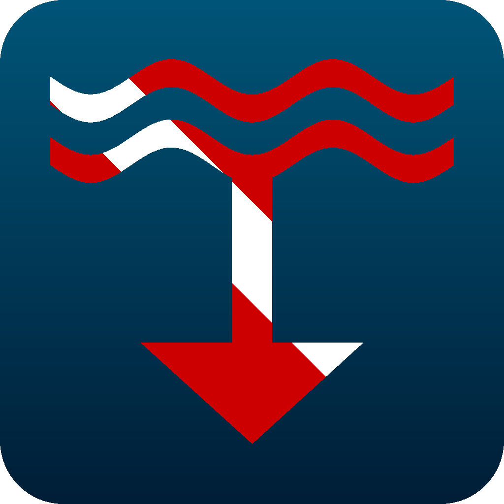

<div>
  
  <h3>Submersion</h3>
  <p><i>A modern, open-source, cross-platform dive logging application.</i></p>
</div>
<br clear="all"/>

Submersion gives scuba divers full ownership of their logbooks—no proprietary formats, no cloud lock-in, no subscription fees. Track analytics, stats, records, and trends across your dives, all stored locally and exportable to open standards. Free and open-source, forever.

## Why Submersion?

Most dive logging software falls into two categories: desktop applications stuck in the past, or mobile apps that lock your data in proprietary clouds. Submersion is different:

- **You Control Your Data** — All data is stored locally in SQLite and can be synced across devices through cloud storage. No account required. No cloud dependency. Export everything, anytime.
- **Truly Cross-Platform** — One app for iOS, Android, macOS, Windows, and Linux. Your logbook works everywhere, and the same details and analytics are available on all platforms.
- **Open Standards** — Full UDDF 3.2 import/export. CSV support. No proprietary formats trapping your dive history.
- **300+ Dive Computers supported** — Connect via USB or Bluetooth. Powered by [libdivecomputer](https://www.libdivecomputer.org/).
- **Technical Diving Ready** — Bühlmann ZH-L16C decompression, multi-gas support, CNS/OTU tracking, trimix blending.
- **Free Forever** — Open source under GPL-3.0. No premium tiers for core features. No ads.

## Data Philosophy

Submersion is built on these principles:

1. **Local-First** — Your data lives on your device. The app works offline, always.
2. **No Lock-In** — Export your entire logbook to UDDF or CSV at any time. Switch apps without losing history.
3. **No Account Required** — Use the app immediately. No sign-up, no email, no tracking.
4. **Open Source** — Audit the code. Fork it. Improve it. Your dive log software should be as transparent as the water.

## Features

### Dive Logging
- Comprehensive dive entry with depth, duration, temperatures, conditions
- Automatic dive numbering with gap detection and renumbering
- Entry/exit times with surface interval calculation
- Multi-tank support with gas mixes (air, nitrox, trimix)
- Buddy tracking with roles (buddy, guide, instructor, student)
- Trip organization for multi-dive expeditions
- Tags, favorites, and star ratings
- Free-text notes

### Dive Sites
- Full site database with GPS coordinates
- Interactive maps with clustering
- Capture location from device GPS
- Reverse geocoding for country/region
- Depth ranges, difficulty ratings, hazard notes
- Weather and tide data integration

### Dive Computer Integration
- **300+ supported dive computers** via libdivecomputer
- Bluetooth LE and USB connectivity
- Manufacturer protocols: Shearwater, Suunto, Mares, Aqualung, and more
- Incremental downloads (new dives only)
- Duplicate detection with fuzzy matching
- Multi-computer support with profile selection

### Profile Analysis
- Interactive depth/temperature/pressure/SAC charts with zoom and pan
- Touch markers showing various metrics
- Ascent rate calculation with color-coded warnings
- Profile event markers (descent, safety stop, gas switch)
- SAC/RMV overlay

### Decompression & Technical Diving
- **Bühlmann ZH-L16C** algorithm with gradient factors
- Real-time NDL, ceiling, and TTS calculations
- 16-compartment tissue loading visualization
- CNS% and OTU oxygen toxicity tracking
- ppO₂ curve with warning thresholds
- MOD/END/EAD calculations

### Equipment Management
- Track all gear with serial numbers, purchase dates, service intervals
- Service reminders with visual warnings
- Equipment sets ("bags") for quick selection
- Weight calculator based on exposure suit and tank type
- Per-dive gear tracking

### Certifications & Training
- Store all certifications with card numbers and dates
- Agency support: PADI, SSI, NAUI, SDI/TDI, GUE, RAID, and more
- Expiry tracking with warnings
- Instructor and dive center records

### Statistics & Records
- Total dives, bottom time, depth statistics
- Breakdown by year, country, site, dive type
- Personal records: deepest, longest, coldest, warmest
- Depth distribution histograms

### Import & Export
- **UDDF 3.2** — Universal Dive Data Format, the open standard
- **CSV** — Spreadsheet-compatible with configurable columns
- **PDF** — Printable logbook pages
- Full database backup and restore

## Getting Started

### Prerequisites

- [Flutter SDK](https://flutter.dev/docs/get-started/install) 3.5.0 or higher

### Quick Start

```bash
# Clone the repository
git clone https://github.com/submersion-app/submersion.git
cd submersion

# Install dependencies
flutter pub get

# Generate database and serialization code
dart run build_runner build --delete-conflicting-outputs

# Run the app
flutter run -d macos    # or: windows, linux, ios, android
```

### Build for Release

```bash
# iOS
flutter build ios

# Android
flutter build apk

# macOS
flutter build macos

# Windows
flutter build windows

# Linux
flutter build linux
```

## Architecture

Submersion follows clean architecture principles with clear separation of concerns:

```
lib/
├── core/                 # Shared infrastructure
│   ├── database/         # Drift ORM schema and migrations
│   ├── deco/             # Decompression algorithms
│   ├── router/           # Navigation (go_router)
│   ├── services/         # Location, weather, database services
│   └── theme/            # Material 3 theming
├── features/             # Feature modules
│   ├── dive_log/         # Core dive logging
│   ├── dive_sites/       # Site management & maps
│   ├── dive_computer/    # Device connectivity
│   ├── equipment/        # Gear tracking
│   ├── statistics/       # Analytics & records
│   └── ...               # Additional features
└── shared/               # Reusable widgets
```

**Tech Stack:**
- **Flutter** — Cross-platform UI framework
- **Riverpod** — Reactive state management
- **Drift** — Type-safe SQLite ORM with migrations
- **go_router** — Declarative navigation
- **fl_chart** — Interactive charts for profiles and statistics
- **flutter_map** — OpenStreetMap integration
- **libdivecomputer** — FFI bindings for dive computer communication

See [ARCHITECTURE.md](ARCHITECTURE.md) for detailed documentation.

## Roadmap

| Version | Status | Highlights |
|---------|--------|------------|
| **v1.0** | Complete | Core logging, sites, gear, statistics, UDDF/CSV/PDF |
| **v1.1** | Complete | GPS integration, maps, tags, profile zoom/pan |
| **v1.5** | In Progress | Dive computer connectivity, deco algorithms, O₂ tracking |
| **v2.0** | Planned | Cloud sync (opt-in), photos, multi-language, community |

See [FEATURE_ROADMAP.md](FEATURE_ROADMAP.md) for the complete development plan.

## Contributing

Contributions are welcome! Submersion is built by divers, for divers.

1. Fork the repository
2. Create a feature branch: `git checkout -b feature/your-feature`
3. Make your changes with tests
4. Submit a pull request

Please run `flutter analyze` and `flutter test` before submitting.

## License

Submersion is free software, released under the **GNU General Public License v3.0**.

You are free to use, modify, and distribute this software. If you distribute modified versions, you must also release the source code under GPL-3.0.

See [LICENSE](LICENSE) for the full text.

## Acknowledgments

Submersion builds on the work of the dive logging community:

- **[libdivecomputer](https://www.libdivecomputer.org/)** — The open-source library powering dive computer communication
- **[Subsurface](https://subsurface-divelog.org/)** — Inspiration and the UDDF format
- **[Flutter](https://flutter.dev/)** — Cross-platform framework making this possible

---

*Dive safe. Log everything. Own your data.*
