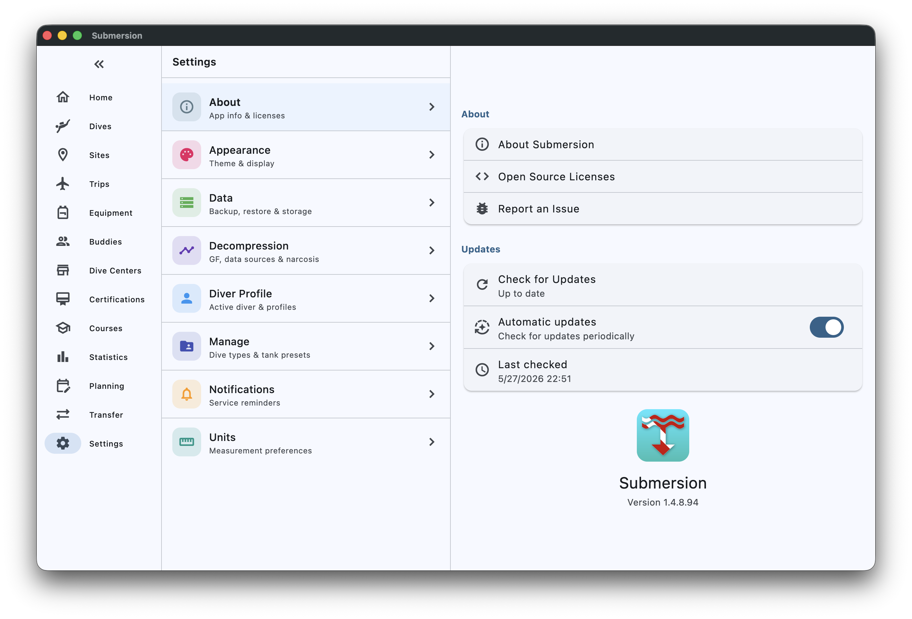
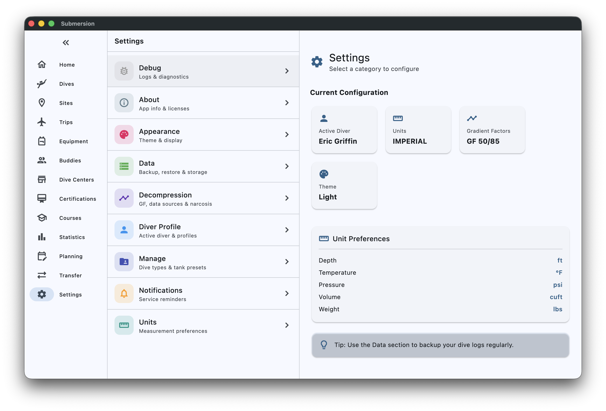
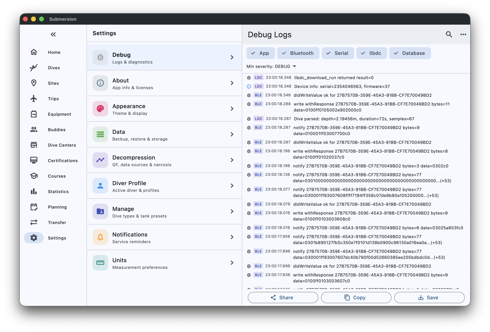
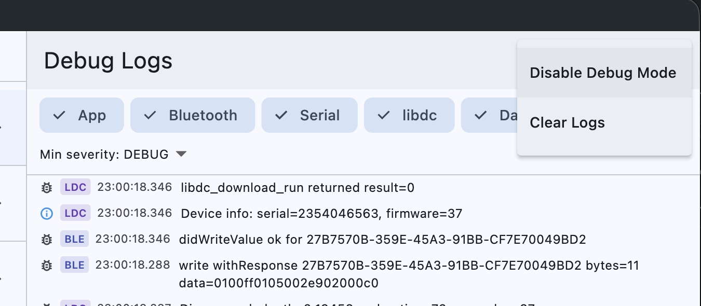

# Debug Mode

Submersion keeps a log of what the app is doing behind the scenes. It always
records warnings and errors; Debug Mode adds the step-by-step detail. Turn it on
when you want to send useful information with a bug report, or when
troubleshooting a dive-computer download, a Bluetooth connection, or an import.

> [!TIP]
> Debug Mode records the detail only from the moment it is turned on. To capture
> a problem in full, turn Debug Mode on **before** you reproduce it.

## Without Debug Mode: Diagnostics

For many bug reports you do not need Debug Mode at all.
**Settings > About > Diagnostics** offers:

- **View log:** the warnings and errors recorded automatically.
- **Copy diagnostics:** the app version, your device and recent log lines,
  ready to paste into a bug report.
- **Open log folder** (on a computer): the folder that holds the log file.

## What Gets Logged

Submersion writes timestamped entries to a log file on the device. Each entry
has a category and a severity so you can filter what you see.

| Category | What it covers |
|----------|----------------|
| **App** | General app events, navigation, errors |
| **Bluetooth** | BLE discovery, pairing, and data transfer |
| **Serial** | USB and serial dive-computer connections |
| **libdc** | Output from the libdivecomputer engine |
| **Database** | Local database queries and migrations |
| **Media** | Photo and video linking, uploads and downloads |

| Severity | When it's used | Recorded |
|----------|----------------|----------|
| **DEBUG** | Verbose, step-by-step detail | With Debug Mode on |
| **INFO** | Routine progress and milestones | With Debug Mode on |
| **WARN** | Something unexpected, but recoverable | Always |
| **ERROR** | Something failed | Always |

The log file is capped at 5 MB. When it grows past that, Submersion drops the
older half automatically, so the file never grows without bound.

## Enable Debug Mode

Debug Mode is hidden so it doesn't get turned on by accident.

1. Open **Settings > About**. The Submersion icon, name and version number are
   at the bottom.
2. **Tap the version number five times.**
3. A "Debug mode enabled" message confirms that detailed recording has started.

A **Debug** entry, "Logs & diagnostics", now appears in the Settings list just
above **About**.

> [!TIP]
> Debug Mode stays on across app restarts. Turn it off when you are done
> troubleshooting (see below).

## Reproduce the Problem

With Debug Mode on, do whatever triggers the issue you want to report: download
a dive, import a file, sync. The events are recorded as they happen.

## View and Filter Logs

Open **Settings > Debug** to see the **Debug Logs**.

| Control | What it does |
|---------|--------------|
| Category chips | Tap a chip (**App**, **Bluetooth**, **Serial**, **libdc**, **Database**, **Media**) to show or hide that category. At least one stays on. |
| **Min severity:** | Hide entries below the chosen severity. Choose **WARN** or **ERROR** to focus on problems. |
| Search | Show only entries whose message contains a word, error message or device name. |

## Share Logs with Support

The three buttons at the bottom of the viewer export what was recorded. Every
export starts with a header naming the app build and device, and passwords,
keys and other secrets are removed.

| Button | What it sends | When to use it |
|--------|---------------|----------------|
| **Share** | The **whole** log as `submersion-debug-logs.txt` through your device's share sheet (email, Messages, AirDrop and so on), with a media report when there is one | The recommended option for a bug report |
| **Copy** | Only the entries **currently shown**, as text on your clipboard | Pasting a small, relevant slice into a GitHub issue |
| **Save** | The **whole** log as `submersion-debug-logs.txt`, to a place you choose | Keeping a copy to attach later |

> [!WARNING]
> **Copy** follows the active filters and copies only what is visible. **Share**
> and **Save** always include the entire log, whatever the filters.

## Clear the Log

To start a fresh log (useful just before reproducing a specific issue):

1. Open **Settings > Debug**.
2. Tap the **three-dot menu** in the top-right corner.
3. Choose **Clear Logs**.

## Disable Debug Mode

When you are done troubleshooting, turn Debug Mode off to go back to recording
warnings and errors only.

1. Open **Settings > Debug**.
2. Tap the **three-dot menu** in the top-right corner.
3. Choose **Disable Debug Mode**.

You return to Settings, and the **Debug** entry disappears from the list.

## Privacy

The log stays on your device until you choose to share it. It is never uploaded
automatically, and is not sent to Submersion or anyone else.

The log can contain technical details such as dive-computer model names,
Bluetooth identifiers, the names of files you imported, and database error
messages. Secrets are removed when you export it, but before sharing a log
outside your trusted circle you may still want to open it in a text editor and
read it through.

## Troubleshooting Debug Mode

| Problem | What to try |
|---------|-------------|
| Tapping the version doesn't turn on Debug Mode | Check you are tapping the version number at the bottom of **Settings > About**, and tap it five times. |
| Only warnings and errors appear | Debug Mode records detail only after it is turned on. Reproduce the issue, then look again. |
| Old entries are missing | The log is capped at 5 MB and older entries are dropped automatically. Clear the log and reproduce just the scenario you want to capture. |
